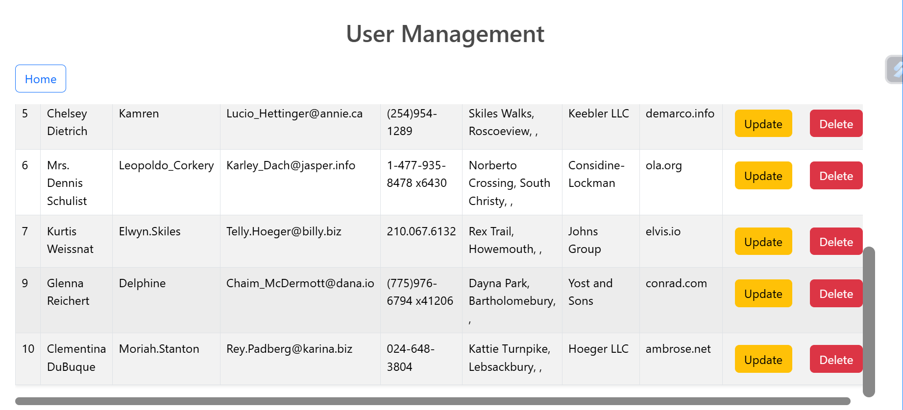

# React Axios Task

**Requirements:**

1. Display all the existing API data in the UI using Axios.
2. Users should be able to perform CRUD operations on user data, including adding, editing, and deleting user records.
3. The user data should be stored in a mock API that can be accessed using Axios fetch.
4. The UI should have a clean and responsive design that is easy to use and navigate.

&nbsp;

> ## User Input Page

&nbsp;

The User Input Page consists of Form for the various field required to create a Data and when clicked on **Add User** Button, Alert of "User added Successfully" will be shown and once confirmed, it redirects to the User Management Page.

Also you can navigate to the User Management Screen by clicking on **Manage Users** Button

&nbsp;

---

> ## User Management Page

&nbsp;

**The Data given in the User Input Page will be added to the table along with the users details fetched from the URL via axios method**.

The table is responsive and scrollable.

To Navigate the User Input Page, you can click on **Home** Button.

&nbsp;

> > ### UPDATE

&nbsp;

When Clicked on the update icon of the data which you want to change under Actions column, the prompt will be shown for all the fields one by one as in above picture. If you have changes of the respective you can enter the data which you want to change, else click on cancel.

You could see only the fields which we provided are updated.

&nbsp;

> > ### DELETE

&nbsp;

When you want to delete the data of a user, you can click on the delete icon and that will ask for the confirmation with User ID information as shown below.

Once Confirmed, the data will be deleted. You could see the data of User ID is deleted below.

---
